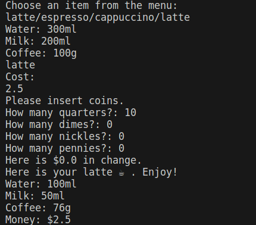

# Hundred Days of Python

An Udemy course made by Dr. Angela Yu.
We start from Day 16 for OOP studies, which is recommended for intermediate learners.

## Setup

1. Clone the git repository;

2. Setup a virtual environment (optional;)

3. '''pip install -r requirements.txt'''

4. Choose a folder with a main.py archive, select it and run it.

## What could go wrong

1. Before running the code you may have to select your Python interpreter manually.
And if you're using a virtual environment you may have to select it as your interpreter.
In this example we used VScode as our IDE, which let you select an interpreter by clicking a non-working import, for example.

## Day 16

The oop-coffe-machine-start folder contains the main.py archive that should be run.
The documentation for the coffee machine code that Dr. Angela Yu developed is not present
in this repo, but it should be understandable by what's on the main.py archive alone.

## Day 17

The quiz-game-start folder contains the main.py archivbe that should be run.
In this folder, it is actually recommended to change the question_model and data archives
according to what kind of quiz you'd like to create. By default, it contains a simple
True or False quiz which we learn to model on Dr. Angela's course.

Note: if you create a quiz that needs more than the question text and its one answer, 
you may need to change the quiz_brain class we've created.

## Day 18

Day 18 has some challenges that are comments. To run them, manually comment
all challenges except the one you want to run. Pay attention to setup variables
that should never be comments, otherwise the code will result in errors.
The last challenge should be runnable by default and is presented on the image above.

Note: These challenges focus on logic, instead of the usual OOP the course have been teaching.

## Day 19

Day 19 is a simple game creating challenge, but we were able to advance on organization
and Python logic skills.

## Day 20 & 21

We create a game based on the classic Snake, using everything we learned until now.
